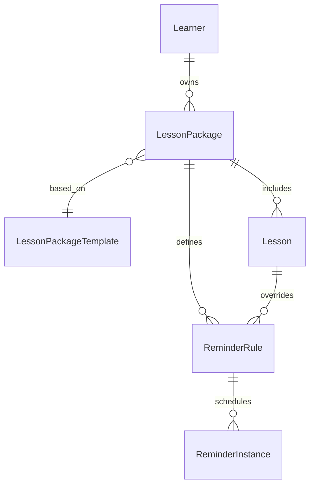

# Lesson Packages & Reminder System Refactor

## Goals
- Model lessons as first-class entities grouped into packages.
- Generate and manage reminders (lesson confirmation, payments, homework, renewal) based on lessons/packages instead of manual creation.
- Support reusable presets (templates) that define package defaults and reminder rules.
- Preserve existing reminder behaviour during migration; map old reminders into new structures.

## Domain Model Overview



### Core Tables

#### `lesson_package_templates`
| Column | Type | Notes |
| --- | --- | --- |
| id | PK | |
| name | String | human-readable |
| description | Text | optional |
| lesson_count | Integer | expected number of lessons |
| duration_days | Integer | length of package |
| default_timezone | String | e.g. `Europe/Moscow` |
| default_config | JSON | default reminder rules, lesson frequency, etc. |
| created_at / updated_at | DateTime | audit |

#### `lesson_packages`
| Column | Type | Notes |
| id | PK |
| learner_id | FK -> learners.id | owner |
| template_id | FK -> lesson_package_templates.id | nullable |
| title | String | display |
| status | Enum | draft / active / completed / cancelled |
| start_date | Date | package start |
| end_date | Date | package end |
| timezone | String | defaults from template |
| total_lessons | Integer | expected |
| notes | Text | |
| created_at / updated_at | DateTime | audit |

#### `lessons`
| Column | Type | Notes |
| id | PK |
| package_id | FK -> lesson_packages.id |
| scheduled_at | DateTime | start of lesson |
| duration_minutes | Integer | optional |
| status | Enum | scheduled / completed / cancelled |
| sequence_index | Integer | order within package |
| teacher_notes | Text | |
| homework_due_at | DateTime | optional specific deadline |
| created_at / updated_at | DateTime | audit |

#### `reminder_rules`
| Column | Type | Notes |
| id | PK |
| package_id | FK -> lesson_packages.id | optional |
| lesson_id | FK -> lessons.id | optional |
| reminder_type | Enum | `lesson_confirm`, `payment_week`, `payment_day`, `homework`, `package_renewal` |
| config | JSON | schedule parameters |
| channel | Enum | `telegram` for now |
| active | Boolean |
| created_at / updated_at | DateTime |

Rules attached to a package apply to all lessons unless overridden by lesson-specific rules. JSON config stores:
```json
{
  "offset": { "unit": "minutes", "value": -60 },
  "send_time": "10:00",                 // optional, HH:MM in package timezone
  "anchor": "lesson_start"              // or `lesson_day`, `package_end`
}
```

#### `reminder_instances`
| Column | Type | Notes |
| id | PK |
| rule_id | FK -> reminder_rules.id |
| package_id | FK -> lesson_packages.id |
| lesson_id | FK -> lessons.id | nullable |
| learner_id | FK -> learners.id |
| scheduled_for | DateTime | actual trigger UTC |
| status | Enum | scheduled / sent / cancelled / failed |
| payload | JSON | cached data (student name, message text template inputs) |
| created_at / updated_at | DateTime |
| last_notified_at | DateTime | |
| last_response | String | reuse from old reminders |
| last_response_at | DateTime |
| last_decline_reason | Text |

### Migration Strategy
1. Introduce new tables alongside existing `lesson_reminders`.
2. Backfill `reminder_instances` from current table to maintain scheduler compatibility.
3. Update CRUD and scheduler to read/write `reminder_instances`.
4. Deprecate `lesson_reminders` once admin UI + scheduler stop using it.

### Scheduler Changes
- Fetch `reminder_instances` where `status = 'scheduled'` and `scheduled_for <= now`.
- When processing, compute next instance by asking corresponding rule/service (e.g., for recurring confirms generate next lesson-based instance).
- Respect package timezone stored in package.

### Admin UI Changes (High Level)
1. New section “Пакеты” with tree: пакеты → уроки → напоминания.
2. Wizard to create package: pick learner, template/preset, generate lessons.
3. Lessons view: mark выполнение, отправить повторное напоминание, задать домашку.
4. Reminder rule editor: toggle homework/payment/confirm/renewal reminders per package or lesson.

### Incremental Delivery
1. Data layer + scheduler refactor with feature parity.
2. Minimal admin UI to list packages/lessons and auto-create reminders.
3. Preset management UI + advanced automation.

## Open Questions
- Pricing/billing fields? (out of scope now)
- Teacher assignments per lesson? (future)
- Multi-timezone support for learners outside Moscow (design allows, default from template).

